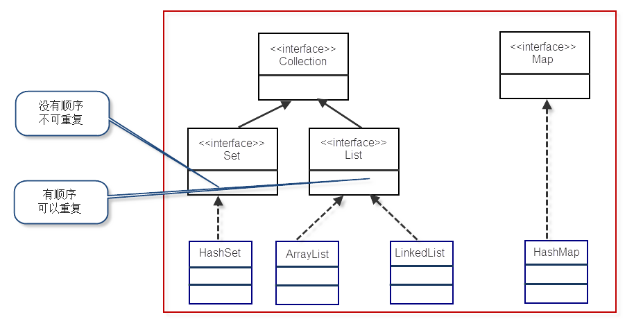

## Collection 容器

### Collection 和 Map 结构



### List

- 有序,可重复的容器(满足`e1.equals(e2)`方法)
- 实现类:
  - ArrayList 数组
    查询效率高,增删效率低,线程不安全
    数组 Array 长度有限,ArrayList 采用数组扩容方式实现
  - LinkedList 链表
    增删效率高
  - Vector 线程安全的数组
    线程安全,效率低 会检查是否获得锁 🔒,没有锁,则等待 `synchronized(同步检查)`
    ```java
    public synchronized int indexOf(Object o, int index) {
    }
    ```
- 使用建议:
  1. 需要线程安全时,需要多个线程共享,用 Vector
  2. 不存在线程安全问题时,查找较多用 ArrayList(一般使用它)
  3. 不存在线程安全问题时,增加和删除较多时使用 LinkedList

### Set

- 无序,不可重复(`e1.equals(e2)==true`时不能加入)
- 甚至,只能有一个 null 元素
- 实现类 HashSet,TreeSet
- HashSet **本质**是:
  相同的 value(为 PRESENT 常量对象),不同的 key 组成的 HashMap
