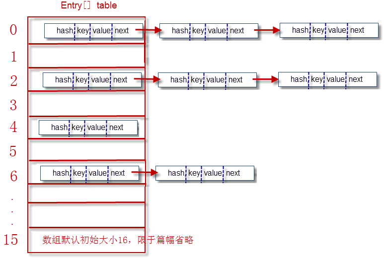
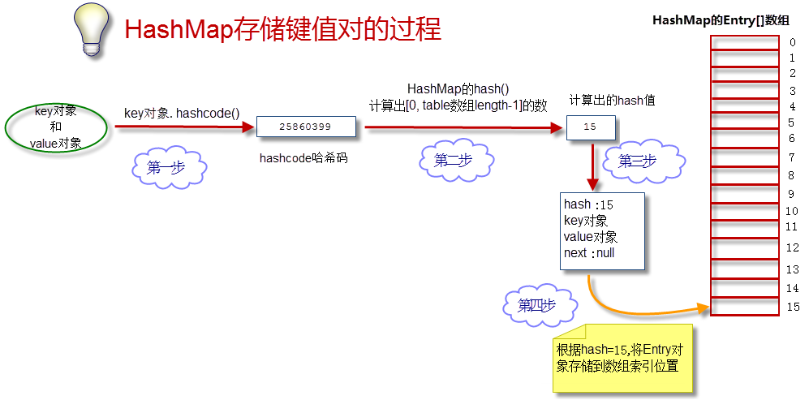

## Map 接口

- 用来存储键值对(key)-(value)的对象
- 常用实现类:HashMap,TreeMap,HashType,Properties

## HashMap 底层原理

本质:数组+链表

- **Entry[] table 就是 HashMap 的核心数组结构,也成为"位桶数组",Entry 是什么?**
  - 一个 Entry 对象(单向链表)存储了:
    1. key:键对象 value:值对象
    2. next:下一个节点
    3. hash:键对象的 hash 值
- **结构图**
  
- **存储数据过程**
  
- JDK8 中，当链表(Entry)长度大于 8 时，链表就转换为红黑树，这样又大大提高了查找的效率
- **hashcode**: 哈希码,由 key 产生
  **hash**: hashcode 经过 HashMap 方法计算的 hash 值
