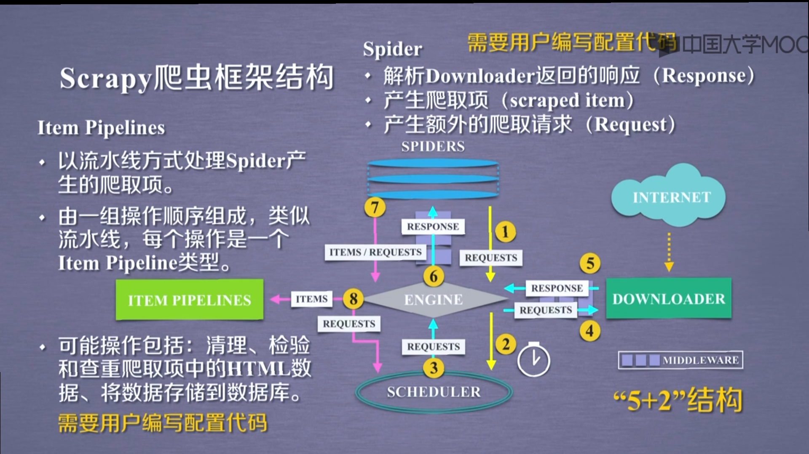

### scrapy 爬虫框架结构

### scrapy 使用步骤

1. `scrapy startproject python123demo`
2. `cd python123demo`
3. `scrapy genspider demo python132.io`
4. `scrapy crawl demo`(demo 为 spider 的 name)

### scrapy 完成爬虫的过程

1. 建立工程和 spider 模板
2. 编写 spider
3. 编写 pipeline
4. 配置优化

### scrapy 常用命令

| 命令         | 说明                | 格式                                         |
| ------------ | ------------------- | -------------------------------------------- |
| startproject | 创建一个新工程      | `scrapy startproject <name>[dir]`            |
| genspider    | 创建一个爬虫        | `scrapy genspider [options] <name> <domain>` |
| setting      | 获取爬虫配置信息    | `scrapy setting [options]`                   |
| crawl        | 运行一个爬虫        | `scrapy crawl <spider>`                      |
| list         | 列出工程中所有爬虫  | `scrapy list`                                |
| shell        | 启动 URL 调试命令行 | `scrapy shell [url]`                         |
